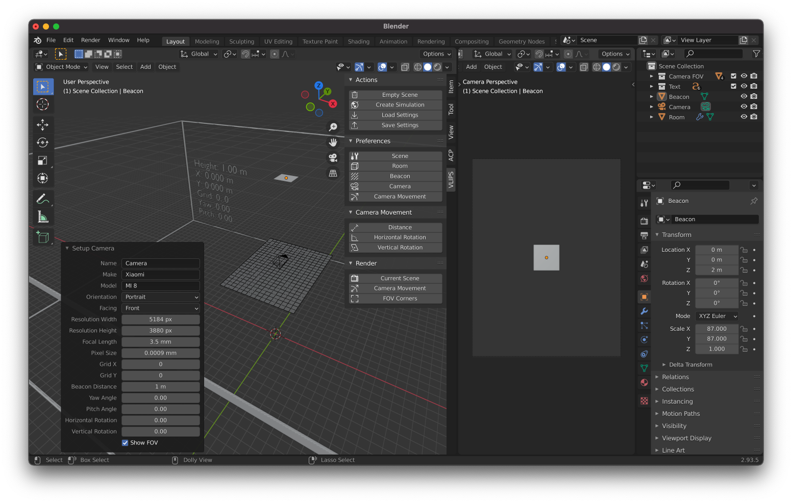
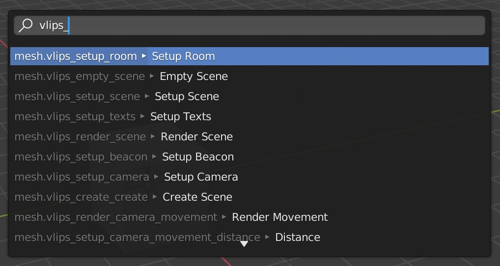
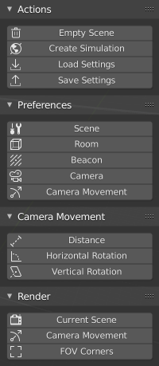
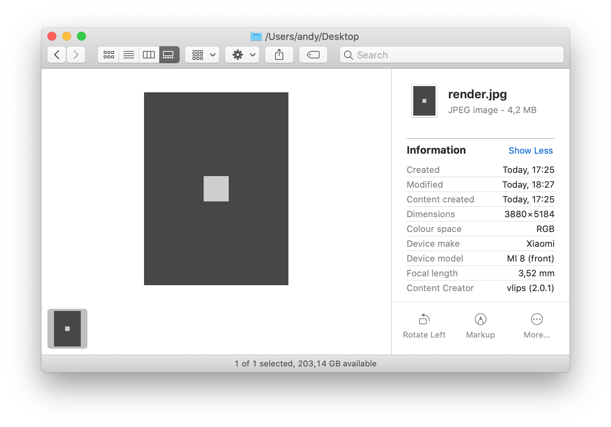

# VLIPS Simulation

A Blender add-on to simulate the location estimation conditions in a room with a visible light beacon and a smartphone camera.

Use it to configure a room with a beacon and a camera. Adjust the room's size, the dimensions and location of the beacon, and the location, inclination, and characteristics of the camera. Then, render the scene to analyze it, or configure the camera to move around the beacon, and render the scene as the camera moves.



## Table of Contents

1. [Requirements](#requirements)
2. [Installation](#installation)
3. [Usage](#usage)
4. [Logging](#logging)
5. [Simulation Fidelity](#simulation-fidelity)
6. [Distance Estimation](#distance-estimation)
    1. [Contour](#contour)
    2. [Corners](#corners)
    3. [Pose](#pose)
    4. [Real](#real)
7. [To Do](#to-do)

## Requirements

This version of the add-on is intended for Blender 3.0.1.

The complete list of requirements is in the file **requirements.txt**. You can install all of them using PIP with the command:

```shell
pip install -r requirements.txt
```

You also need to install them for Blender's copy of Python:

```shell
/Applications/Blender.app/Contents/Resources/2.93/python/bin/python3.9 -m pip install -e vlips
```

## Installation

Run `package.sh` in the same folder the script is to create the add-on ZIP file. To install it, open Blender, select **Edit > Preferences > Add-ons**, click on **Install**, and select the ZIP file you just created. Mark the checkbox preceding the add-on name to enable it, so you can use the add-on through Blender's user interface.

> **Hint**: change your render engine to [**Workbench**][workbench] if you want to boost render times. If you want this engine to be the default, click on **File > Defaults > Save Startup File**.

[workbench]: https://docs.blender.org/manual/en/latest/render/workbench/introduction.html "The Workbench Engine is a render engine optimized for fast rendering during modeling and animation preview."

## Usage

This add-on exposes to the user in two ways: through operators and through panels.

Length measures are shown in meters in the operators and panels, angles are shown in degrees. Internally, the addon uses millimeters to keep all the calculations as integer numbers whenever possible.

To access the operators, press **F3** and type `vlips_` in the text box. Blender will show you all the operators of the add-on:



Scroll through the list to see all the operators the add-on offers:

- **Create Scene**: adds a room, a beacon, and a camera to the scene.
- **Empty Scene**: deletes every item in the scene, so new items can be placed.
- **Render Movement**: renders a series of scenes where the camera location changes. The camera can change its distance relative to the beacon, or its angle.
- **Render Scene**: renders the current scene from the camera's point of view, saving it in the file which path the user selects.
- **Render FOV Corners**: renders a series of scenes where the camera is located in the four corners of each field of view (FOV).
- **Setup Beacon**: adds a beacon to the room.
- **Setup Camera**: adds a camera to the room.
- **Setup Camera Movement**: defines the values needed to describe a camera movement and where to save the renders of it.
- **Distance**: set the camera movement when its distance relative to the beacon changes.
- **Horizontal Rotation**: set the camera movement when its horizontal rotation angle relative to the beacon changes.
- **Vertical Rotation**: set the camera movement when its vertical rotation angle relative to the beacon changes.
- **Setup Room**: adds a room to the scene.
- **Setup Scene**: changes the scene setup with defaults more suitable for the simulation.
- **Setup Texts**: adds texts to the wall of the room showing some information.
- **Load Settings**: load add-on settings from a YAML file, previously created using the operator to save settings.
- **Save Settings**: save add-on settings to a YAML file that can later be loaded using the corresponding operator.

Each of these operators opens a dialog box in the lower-left corner of the screen that shows different customizable parameters. Rest the pointer over them to get their description. Click and drag over their numeric values to change them and see the results in real-time.

To access the panels, press **n** while the 3D viewport is active. You will see a series of tabs on the right border of the viewport. By default, there are three: **Item**, **Tool**, and **View**. If this add-on is enabled, a new one named **VIPS** should be below them. If you click on it, you will see something like this:



The first section, named **Actions**, contains four buttons:

- **Empty Scene**: performs the operator **Empty Scene**.
- **Create Simulation**: performs the operator **Create Simulation**.
- **Load Settings**: performs the operator **Load Settings**.
- **Save Settings**: performs the operator **Save Settings**.

The first two buttons are handy shortcuts to access the most frequently used operators. What you will usually do when using this add-on is empty the scene and then add the simulation elements to it.

The second section, named **Preferences**, contains five buttons:

- **Scene**: performs the operator **Setup Scene**.
- **Room**: performs the operator **Setup Room**.
- **Beacon**: performs the operator **Setup Beacon**.
- **Camera**: performs the operator **Setup Camera**.
- **Camera Movement**: performs the operator **Setup Camera Movement**.

Again, these buttons are shortcuts to the operators. Usually, you will only need to click **Camera Movement** to select the folder where the renders will be saved.

The third section, named **Camera Movement**, contains three buttons:

- **Distance**: performs the operator **Beacon Distance**.
- **Horizontal Rotation**: performs the operator **Horizontal Rotation**.
- **Vertical Rotation**: performs the operator **Vertical Rotation**.

Use these buttons to configure the movement the camera will describe relative to the beacon. In every case, the beacon will always be centered from the point of view of the camera.

The fourth section, named **Render**, contains two buttons:

- **Current Scene**: performs the operator **Render Scene**.
- **Camera Movement**: performs the operator **Render Camera Movement**.
- **FOV Corners**: performs the operator **Render FOV Corners**.

The image you obtain when rendering the scene contains all the details needed to recreate the scene, stored as EXIF data. You can use many tools to extract these data, like [exiftool][exiftool]. Here you can see a small subset of said data, exposed through macOS Finder:



This render was created from a simulation where the camera mimicked the front one from a Xiaomi Mi 8, with a focal length of 3.52 mm.

[exiftool]: https://exiftool.org "ExifTool is a platform-independent Perl library plus a command-line application for reading, writing and editing meta information in a wide variety of files."

## Logging

To activate [Blender's logging from Python][logging] in macOS, you just have to copy the file **setup_logging.py** to the folder **/Applications/Blender.app/Contents/Resources/2.93/scripts/startup**. Then, start Blender from a terminal window. The log output will appear right there.

[logging]: https://code.blender.org/2016/05/logging-from-python-code-in-blender/ "Logging from Python code in Blender"
